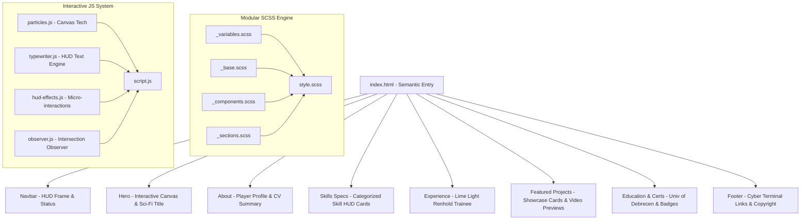

# Architectural Blueprint: Portfolio Overhaul (Game Developer / Cyber-HUD Theme)

## Executive Summary
This document outlines the architectural specification and implementation plan for transforming **Kaung Khant Zaw's** portfolio website into a high-performance, responsive **Game Developer Portfolio** featuring a **Modern Cyber/Sci-Fi HUD** aesthetic.

---

## Architecture & System Design



---

## Directory & Modular File Structure

```
My_Profolio/
├── index.html                      # Semantic DOM hierarchy & accessible markup
├── README.md                       # Comprehensive project README
├── plans/
│   └── portfolio_overhaul_plan.md # Architectural Specification
├── css/
│   ├── style.scss                  # Primary SCSS Entry
│   ├── style.css                   # Compiled CSS
│   ├── style.css.map
│   └── partials/
│       ├── _variables.scss         # Neon Cyber colors, Orbitron/Rajdhani fonts, HUD borders
│       ├── _base.scss              # Resets, dark scrollbar, scanline overlay, ambient glow
│       ├── _typography.scss        # Google Fonts setup (Orbitron / Rajdhani / Chakra Petch)
│       ├── _components.scss        # Cyber buttons, glowing cards, badges, skill progress bars
│       ├── _navbar.scss            # Futuristic navigation bar with status indicator
│       ├── _hero.scss              # Hero banner, typewriter cursor, interactive background canvas
│       ├── _about.scss             # About section, player stats HUD card
│       ├── _skills.scss            # Technical skills matrix & certifications display
│       ├── _experience.scss        # Career timeline component
│       ├── _projects.scss          # Video/Media cards with tech badges and interactive hover
│       ├── _education.scss         # Academic journey & certifications grid
│       └── _footer.scss            # Terminal-inspired footer
├── js/
│   ├── script.js                   # Main application initializer
│   └── modules/
│       ├── particles.js            # Interactive cyber particle / grid canvas background
│       ├── typewriter.js           # Dynamic HUD typing effect
│       ├── hud-effects.js          # Audio/toggle, hover tilt, micro-interactions
│       └── observer.js             # Intersection Observer for scroll animations
└── Resources/                      # Media assets (videos, screenshots, icons)
```

---

## Detailed Implementation Phases

### Phase 1: Architectural Setup & Modularization
- Reorganize monolithic SCSS into structured partials inside `css/partials/`.
- Break monolithic JavaScript into clean ES/modular JS components in `js/modules/`.
- Inject Google Fonts (`Orbitron`, `Rajdhani`, `Chakra Petch`) into `index.html`.

### Phase 2: Cyber/Sci-Fi Theme Engine & Global Styles
- Define CSS/SCSS variables for Cyber Neon palette (`cyan #00f3ff`, `neon green #00ff66`, `magenta #ff0055`, `dark void #0a0b10`).
- Create HUD visual effects: corner brackets, scanlines, glowing borders, animated laser lines.
- Implement HTML5 `<canvas>` background engine with interactive floating node particles.

### Phase 3: CV Content & Section Overhaul
- **Hero & Contact**: Name, title (*Computer Science Graduate / Game Developer*), location (*Debrecen, Hungary*), email, phone, and social links.
- **About Summary**: Player Profile / Bio alignment with exact CV details.
- **Skills Matrix**: Grouped by Programming Languages (C#, Java, C++, C), Game Dev (Unity, Lua), Databases (MySQL, Oracle, SQL), Tools (Git, Jira, AWS, Azure).
- **Experience**: Web Development Trainee at Lime Light Renhold (March 2025 – May 2025).

### Phase 4: Featured Projects & Media Showcase
- Build HUD Project Cards featuring auto-playing muted preview videos for:
  1. **Fantasia** (Idle/incremental game in Unity, thesis project)
  2. **Reinforcement Learning With Unity** (Shield Wizard, ML-Agents)
  3. **Jira Forge Application** (Custom Field Statistics Jira Forge app)
  4. **CooKitchen** (3D Unity game inspired by Code Monkey)
- Add hover glow effects, modal/expanded view capabilities, tag badges, and GitHub repository links.

### Phase 5: Education & Certifications Timeline
- **Education**: BSc in Computer Science, University of Debrecen, Hungary (2022–2026) with key coursework list.
- **Certifications Showcase**:
  - Unity Certified User: Programmer
  - Microsoft Certified Azure Fundamentals (AZ-900)
  - IT Specialist: Java
  - IT Specialist: HTML & CSS
  - i-Days Hackathon Participant

### Phase 6: Responsiveness, Accessibility (a11y) & Performance Audit
- Ensure full responsiveness across mobile, tablet, desktop, and ultra-wide displays.
- High contrast colors, proper ARIA labels, semantic HTML tags (`<header>`, `<nav>`, `<main>`, `<section>`, `<article>`, `<footer>`).
- Smooth scroll, clean performance optimizations, fast load times.

---

## CV Data Mapping Checklist

| CV Field | Value | Target UI Component |
|---|---|---|
| **Name** | Kaung Khant Zaw | Hero / Navigation Header |
| **Title** | Computer Science Graduate / Game Developer | Hero Subtitle |
| **Location** | Debrecen, Hungary | Contact / Hero Info HUD |
| **Contact** | kaungkhantzaw011@gmail.com \| +36 20 617 6033 | Contact HUD / Footer |
| **Links** | GitHub, LinkedIn | Header & Footer Social Icons |
| **Education** | BSc Computer Science, Univ of Debrecen (2022-2026) | Education Timeline |
| **Skills** | C#, Java, C++, C, Unity, Lua, MySQL, Oracle, Git, Jira, AWS, Azure | Technical Skills HUD Matrix |
| **Experience** | Web Dev Trainee, Lime Light Renhold (Mar-May 2025) | Experience Section |
| **Projects** | Fantasia, RL Shield Wizard, Jira Forge App, CooKitchen | Featured Projects Showcase |
| **Certs** | Unity Certified, Azure AZ-900, IT Specialist Java/Web, i-Days | Certifications Grid / Badges |
